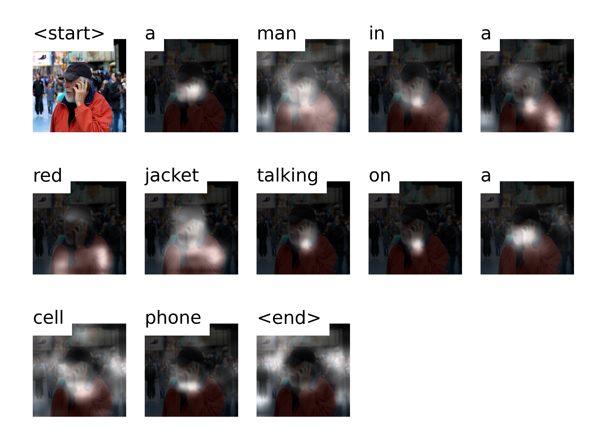

# Image Caption

**目标：给定图像输入，采用跨模态注意力机制，指导模型关注图像的对应区域，从而得到合理的内容描述，并通过可视化注意力区域证明模型关注了正确的图像区域。**

📖<a href="#refer-id">参考文献</a>

🎈<a href="#exp">一些有趣的例子</a>

🔍<a href="#eval">评价指标</a>

😀[下载模型](https://github.com/CAOANJIA/show-attend-and-tell/releases/tag/version1.0.0)

## 具体实现

### Model

- **模型总览**  

  采用Encoder-Decoder架构和跨模态Attention机制，参考[1](#refer-id)。

- **Encoder**: ``VGG19``[2](#refer-id)
  
  1. 使用``torchvision.models``中在``ImageNet``上预训练好的模型  。
  
  2. 去除``fc``层和最后一个``maxpool``层，即输出为``14x14x512``的特征图  。

- **Decoder**: ``LSTM``[3](#refer-id)
  
  1. ``h0``和``c0``利用encoder输出的特征图初始化  。
  
  2. 且不使用预训练词向量如``GloVe``  。
  
  3. 采用``dropout``避免过拟合  。

- **Attention**: ``scaled dot-product attention``[4](#refer-id)
  
  1. 利用``hidden state``经过``fc``层获得``Query``，feature map经过2个不同的fc层获得``Key``和``Value``，  
     
     Query size: *[att_dim, 1]*, Key size: *[num_pixels, att_dim]*,   
  
     score size: *[num_pixels, 1]*, Value size: *[num_pixels, encoder_dim]*  。
     
  2. 缩放点积并依次通过``relu``、``softmax``获得``attention score``  。
  
  3. 将``Value``的每个pixel的所有channel都乘上该pixel对应的score，然后对每个channel求和，得到最终的图像表示  。

  4. 最后将``word embedding``与此向量``concat``，作为LSTM的输入  。
  
- NOTE: 
  
  每轮``LSTMCell``的迭代都需要做一次attention，可认为是当前序列所注意的图像区域  。

### Pretrain

- 优化器  
  
    ``Adam``，对于decoder将前5个Epoch的``lr``设为``5e-4``，中间3个Epoch的``lr``设为``(5e-4)/2`` ，最后2个Epoch的``lr``设为``(5e-4)/4``  。
    
- 损失函数
  
    ``loss = cross entropy + doubly stochastic regularization``（论文中的设定，鼓励模型既关注图像的每个部分又关注具体目标）。
    
- 验证部分
  
  1. 利用``BLEU4``分数作为模型选择的依据。
  
  2. ``teacher forcing``下的验证集分数为
     
     *E0: 19.68; E1: 21.07; E2: 21.69; E3: 22.00; E4: 22.26; E5: 22.67; E6: 22.76; E7: 22.74; E8: 22.78; **E9: 22.82***。

- 其他超参数
  
    将预训练轮数设为``10``个``Epoch``，``batch_size``设为``64``，LSTM的``hidden_size``设为``768``，``attention dim``设为``512``，``word embedding``维度设为``256``，``dropout``设为``0.5``。
    
- 训练时间
  
    在单卡``NVIDIA RTX A5000``下，单精度训练一个Epoch约耗时33分钟。
    
- NOTE: 
  
  1. ``pack_padded_sequence``的使用，不能写成
     
     ~~predictions, _ = pack_padded_sequence(predictions, decode_lens, batch_first=True)~~
     
     的形式，而是
     
     *predictions = pack_padded_sequence(predictions, decode_lens, batch_first=True)[0]* 。
  
  2. 若不fine-tune，必须将encoder的所有参数的``requires_grad``设为False。
  
  3. 一开始尝试了多种lr并尝试微调``VGG``，训练效果不佳，猜测是因为简单地resize图像至``3x224x224``，因此利用``PIL.Image``对图像重新预处理（利用``crop``和``ANTIALIAS``）。

### Fine-tune

- 优化器
  
    encoder和decoder均为``Adam``，初始``lr``均设为``1e-4``，每个epoch下降20%。
    
- 验证部分
  
  `teacher forcing`下验证集BLEU4分数为
  
  *E0: 23.15;  E1: 23.60;  E2: 23.65;  E3: 23.82;  **E4: 23.89**;  **E5: 23.93***
  
  可以看到，模型得分上升趋势减缓，E4到E5的提升很小，为了防止过拟合，选择E4对应的模型。
  
- 其余参数
  
    将微调轮数设为6个Epoch，``batch_size``设为``32``，其余与预训练相同。
    
- 训练时间
  
    在单卡``NVIDIA RTX A5000``下，单精度训练一个Epoch约耗时70分钟。
    
- NOTE: 
  
  可以看到，经过6个Epoch，验证集BLEU4分数仍然呈现上升趋势，但趋势减缓严重，因此为了防止过拟合，不再进行训练，经过比较，模型E4的确表现比E5好，验证了的想法。

### Evaluation 

- 方法

    ``BeamSearch``, ``Autoregression``

    1. 逐步迭代更新。

    2. 计算过程需要记录：**当前时间步生成单词的来源**`prev_word_inds`（即前一个词的下标）、**当前生成的单词是什么**`next_word_inds`（即对应词表的下标）、**已经结束的句子的下标**`complete_inds`（用于缩小beam_size终止对其的继续计算）、**未结束句子的下标**`incomplete_inds`（用于继续计算，且减少不必要的计算）、**所有已结束句子**`complete_seqs`、**所有已结束句子得分**`complete_seqs_scores`（通过计算topk累加得到）、**未结束句子**`seqs`。

    3. 最终选择最高得分的句子得到**结果句子**`seq`。

- 指标

    ``BLEU4``, ``METEOR``

- 参考论文得分

  | BLEU4 | METEOR |
  |:-----:|:------:|
  | 24.3  | 23.90  |

- 的模型得分

  <table align="center">
      <tr>    <th rowspan="2">beam_size</th>    <th colspan="2" align="center">BLEU4</th>    <th colspan="2" align="center">METEOR</th>	</tr>
      <tr>    <th>w/o fine-tuning</th>    
          	<th>w/ fine-tuning</th>   
          	<th>w/o fine-tuning</th>    
          	<th>w/ fine-tuning</th>	</tr>
      <tr>    <td align="center">1</td>    
          	<td align="center">28.18</td>    
          	<td align="center">29.66</td>    
       	<td align="center"><strong>28.25</strong></td>    
       	<td align="center">29.42</td>	</tr>
   <tr>    <td align="center">2</td>    
       	<td align="center">30.02</td>    
       	<td align="center">32.14</td>    
       	<td align="center">28.17</td>    
       	<td align="center"><strong>29.50</strong></td>	</tr>
   <tr>    <td align="center">3</td>    
       	<td align="center"><strong>30.31</strong></td>    
       	<td align="center"><strong>32.18</strong></td>    
       	<td align="center">27.92</td>    
       	<td align="center">29.24</td>	</tr>
   <tr>    <td align="center">4</td>    
       	<td align="center">30.04</td>    
       	<td align="center">31.93</td>   
       	<td align="center">27.67</td>   
       	<td align="center">28.96</td>	</tr>
   <tr>    <td align="center">5</td>   
       	<td align="center">30.19</td>   
       	<td align="center">31.80</td>  
       	<td align="center">27.58</td>   
       	<td align="center">28.85</td>	</tr>
  </table>

- NOTE: 

  1. BLEU4指标，求语料库级别的BLEU4分数。

  2. METEOR指标，对于每1个`hypothesis`，求其与对应的5个`reference`的得分的平均值，再对全部得分求算术平均（算数平均的计算方法可能不是标准方法，若不正确请指正）。

### Visualization 

- 可视化，显示每个时间步的attention区域。

  相比于Evaluation阶段，只是去掉了指标得分的计算，增加了**注意力分数**`alphas`的计算和可视化。

- good examples：
  
  
  
  ------
  
  
  
  
  
  ------
  
  
  
  
  
  ------
  
  
  
  
  
  
  
- bad examples：
  
  

## 结果 

- 在不微调Encoder的情况下模型在测试集上的BLEU4得分高于原论文。

- 在微调Encoder后模型得分普遍更高。

- 无论是否微调，``beam_size``增加时BLEU分数先增加再减小,1到2时分数提升较明显，在3时达到最高（不微调达到30.31，微调达到32.18），在4到5时变得不稳定。

- 虽然模型在验证集上以``teacher forcing``生成的文本BLEU4分数并不算高，但是在测试集上以``autoregression``生成的表现却令人满意。

## 引用

> [1] Xu, Kelvin, et al. "Show, attend and tell: Neural image caption generation with visual attention." *International conference on machine learning*. PMLR, 2015.

> [2] Simonyan, Karen, and Andrew Zisserman. "Very deep convolutional networks for large-scale image recognition." *arXiv preprint arXiv:1409.1556* (2014).

> [3] Hochreiter, Sepp, and Jürgen Schmidhuber. "Long short-term memory." *Neural computation* 9.8 (1997): 1735-1780.

> [4] Vaswani, Ashish, et al. "Attention is all you need." *Advances in neural information processing systems* 30 (2017).

## 附录

- 参考
  1. [Karpathy's splits of MSCOCO](https://github.com/karpathy/neuraltalk2)  
  2. [Image Caption Tutorial](https://github.com/sgrvinod/a-PyTorch-Tutorial-to-Image-Captioning)  
  
- 数据集下载  
  
  [MSCOCO-2014](https://cocodataset.org/#download)  
